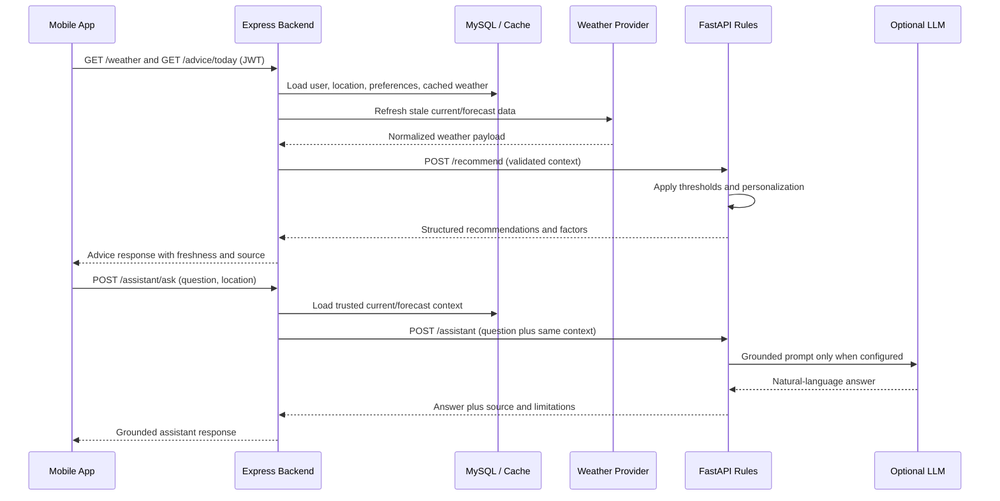

# WeatherWise AI
### Recommendation Architecture
*Day 02 deliverable: recommendation inputs, outputs, and AI data flow*

| Field | Detail |
|---|---|
| Project | WeatherWise AI (Smart Weather Assistant) |
| Document | Day 02 - Recommendation Architecture |
| Owner | AI rotation |
| Version | 1.0 |
| Status | Approved contract for implementation |
| Related documents | PRD, TRD, BSD, AFD, Test Strategy |

## 1. Purpose

This document is the contract between the mobile app, the Express backend, and
the FastAPI recommendation service. It defines the data required to generate
weather advice, the response shown to the user, and the path that data follows.

The recommendation service is deterministic first. Every recommendation must
be traceable to one or more supplied weather or preference factors. A language
model may later rephrase an answer for the AI Assistant, but it must not invent
weather facts or replace the rule-engine decision.

## 2. Responsibilities

| Component | Responsibility |
|---|---|
| Mobile app | Sends the selected location and user intent to the Express API; renders recommendations and explanations. |
| Express backend | Authenticates the user, loads trusted weather/cache data, validates the request, calls FastAPI, and normalizes errors. |
| MySQL | Stores users, preferences, plants, locations, cached weather, forecasts, and history. |
| Weather provider | Supplies current conditions and forecasts to the backend only. |
| FastAPI recommendation service | Applies rules, personalization, scoring, and explainability; returns structured recommendations. |
| AI Assistant adapter | Uses the same trusted context to answer a natural-language question; it cannot call external weather providers directly. |

## 3. Recommendation Request

The Express backend sends `POST /recommend` to the internal FastAPI service.
All temperatures are Celsius, wind speed is km/h, rain probability is a
percentage, and timestamps are ISO 8601 with an offset or `Z`.

### 3.1 Envelope

```json
{
  "request_id": "req_01JWEATHERWISE",
  "user_id": "user_123",
  "intent": "daily_advice",
  "location": {
    "id": "loc_home",
    "label": "Home",
    "latitude": 6.9271,
    "longitude": 79.8612,
    "timezone": "Asia/Colombo"
  },
  "current": {
    "observed_at": "2026-09-07T08:00:00+05:30",
    "temperature_c": 31.5,
    "feels_like_c": 34.2,
    "humidity_percent": 72,
    "wind_speed_kmh": 18,
    "uv_index": 8,
    "condition": "partly_cloudy",
    "rain_probability_percent": 20
  },
  "forecast": {
    "hours": [
      {
        "time": "2026-09-07T17:00:00+05:30",
        "temperature_c": 28.0,
        "rain_probability_percent": 75,
        "rain_intensity": "moderate",
        "condition": "rain"
      }
    ],
    "days": []
  },
  "preferences": {
    "cold_tolerance": "medium",
    "preferred_activity": "walking",
    "preferred_activity_time": "17:00",
    "units": "metric"
  },
  "plants": []
}
```

### 3.2 Input rules

- `request_id`, `location`, and `current` are required for every intent.
- `forecast` is required for `daily_advice`, `activity_score`, `travel`, and
  `plant_care`; it may be empty only when the backend explicitly marks the
  forecast as unavailable.
- `preferences` is optional. Missing values use neutral defaults and must not
  cause a request to fail.
- `plants` is required for `plant_care` and contains only plants owned by the
  authenticated user.
- Provider data is normalized by Express before it reaches FastAPI. The AI
  service never receives provider-specific field names.
- Coordinates are used for location context and must be validated as latitude
  `-90..90` and longitude `-180..180`. They are not displayed in advice.

### 3.3 Supported intents

| Intent | Required context | Result |
|---|---|---|
| `daily_advice` | Current, forecast, preferences | Clothing, umbrella, hydration, UV, travel, and general advice. |
| `activity_score` | Current, forecast, activity preference | Scores for walking, running, and cycling plus best time. |
| `travel` | Origin current/forecast and destination current/forecast | Risk level, score, factors, and optional departure time. |
| `plant_care` | Current, forecast, plant profiles | Water now, water later, or skip with reasoning per plant. |
| `alerts` | Current and forecast | Severe-weather alerts only. |

## 4. Recommendation Response

FastAPI returns HTTP 200 for a valid request, even when no rule is triggered.
The backend passes through only the normalized fields below.

```json
{
  "request_id": "req_01JWEATHERWISE",
  "generated_at": "2026-09-07T08:00:02Z",
  "source": "deterministic_rules",
  "data_freshness": "2026-09-07T08:00:00+05:30",
  "recommendations": [
    {
      "id": "hydration-heat-01",
      "category": "hydration",
      "severity": "warning",
      "title": "Stay hydrated",
      "message": "Drink water regularly and carry water for outdoor activity.",
      "action": "drink_water",
      "factors": [
        { "name": "feels_like_c", "value": 34.2, "unit": "celsius" },
        { "name": "uv_index", "value": 8, "unit": "index" }
      ],
      "score": null,
      "valid_until": "2026-09-07T18:00:00+05:30"
    }
  ],
  "alerts": [],
  "assistant_context": {
    "summary": "Warm with high UV; rain is more likely near 17:00.",
    "limitations": []
  }
}
```

### 4.1 Output rules

- `recommendations` is always an array. A safe day returns one `general`
  recommendation rather than an empty or null value.
- `severity` is one of `info`, `success`, `warning`, or `danger`.
- `category` is one of `clothing`, `umbrella`, `hydration`, `travel`,
  `outdoor`, `plant-care`, or `general`.
- `factors` contains the actual values that caused the rule to fire. This is
  the explanation displayed when an advice item is expanded.
- `score` is present only for scored results and is normalized to `0..100`.
- `valid_until` prevents stale advice from being treated as current.
- `source` is `deterministic_rules`, `gemini_grounded`, or
  `deterministic_fallback`. The latter is used when optional AI text is
  unavailable.

## 5. AI Data Flow



### 5.1 Request path

1. The mobile app requests advice for the active saved location.
2. Express authenticates the JWT and verifies that the location belongs to the
   user.
3. Express reads cached weather and refreshes it when stale. Provider failures
   use the latest valid cache and mark the response as stale.
4. Express combines current weather, forecast, preferences, and relevant plant
   profiles into the canonical request.
5. FastAPI validates the request, evaluates rules, applies preferences, and
   returns explainable results.
6. Express validates the response, adds API metadata, and returns it to mobile.
7. The mobile app renders summary cards; detail views use `factors` and
   `valid_until` for explanation and freshness.

### 5.2 Failure and fallback behavior

| Failure | Backend behavior | Mobile behavior |
|---|---|---|
| Weather provider timeout | Use valid cache and mark `data_freshness`; otherwise return `WEATHER_UNAVAILABLE`. | Show last-known advice with its timestamp, or a retry state. |
| FastAPI timeout/5xx | Return `AI_SERVICE_UNAVAILABLE`; do not fabricate advice. | Show cached advice if still valid, otherwise show retry. |
| Invalid AI response | Log request ID, discard the response, and return `AI_INVALID_RESPONSE`. | Show a recoverable error. |
| Optional LLM unavailable | Return deterministic recommendations or `deterministic_fallback`. | Show the answer without implying generative AI was used. |
| Missing optional user preference | Apply neutral defaults. | No error; recommendation remains explainable. |

## 6. Implementation Mapping

Day 03 implements the deterministic rule engine (`ai/engine/`) with centralized
thresholds, condition categories, explainable recommendations, priority sorting,
and safety conflict resolution. `/recommend` still accepts the compact Day 1
payload and also accepts the Day 02 envelope (`current` + optional `forecast`).

Remaining growth:

1. Preference-aware threshold shifts (FR-20).
2. Travel comparison and plant-care intents.
3. Express proxy and mobile service integration.

## 7. Traceability and Acceptance Checks

| Requirement | Contract evidence |
|---|---|
| PRD FR-06 | Categories and actionable messages in `recommendations`. |
| PRD FR-07 to FR-11 | Severity, alerts, and weather factors. |
| PRD FR-12 to FR-14 | `travel`, `activity_score`, and `plant_care` intents. |
| PRD FR-20 | `preferences` input and personalization step. |
| TRD security | Mobile calls Express only; provider and AI keys stay server-side. |
| Test Strategy TC-014 to TC-022 | Threshold boundary, explanation, score, and preference cases. |

Day 02 is complete when a mocked request can be transformed into this
canonical response, every recommendation includes its triggering factors, and
the service failure paths preserve a truthful fallback or a clear error.